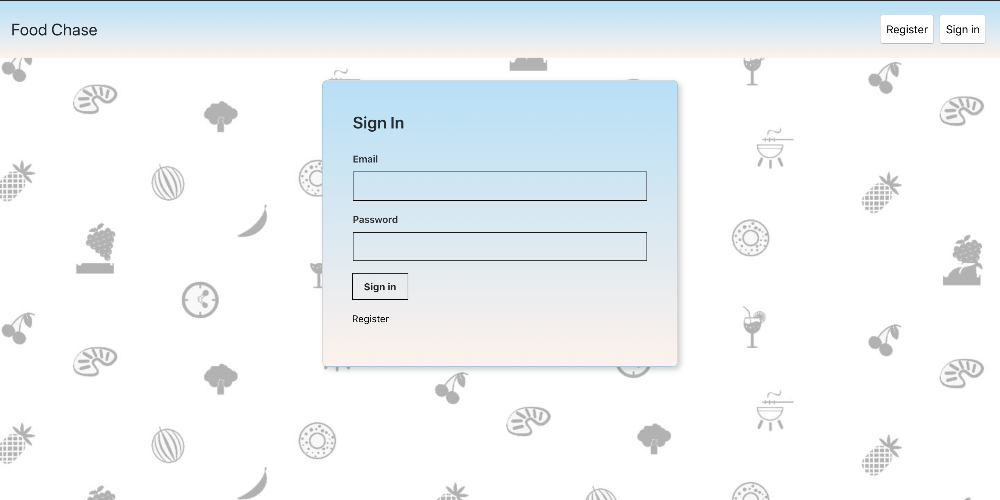
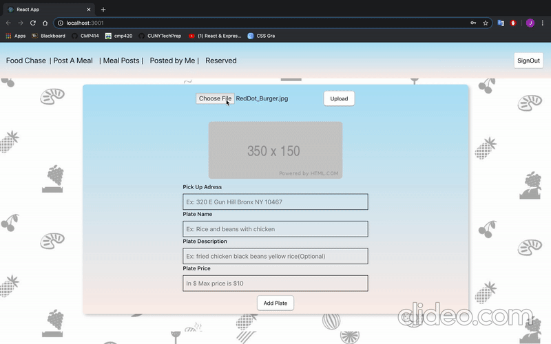

# food-chase

This is a full Stack JavaScript application that allows restaurants to make posts about foods that will get thrown away. They can sell the dish for a reduced price.

Users can sign up to view the food available, make a reservation and then procced to pick it up at the restaurant location.

## Landing page

## Register page

## Login page

## Restaurant posting a dish

## Restaurant removing a dish

## Customer reserving a dish and completing after pick up

